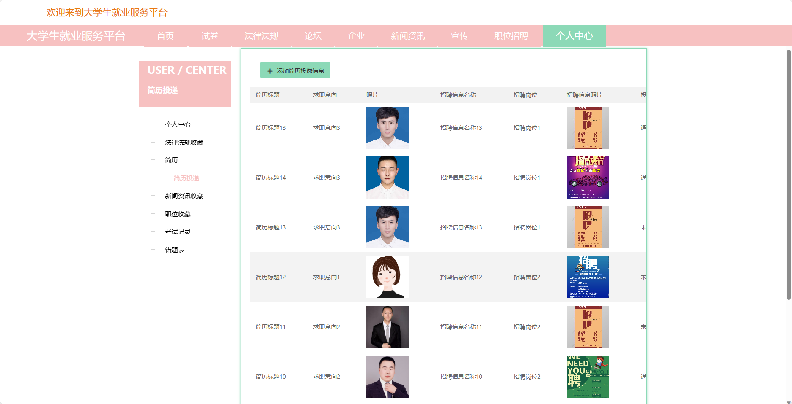

基于SpringBoot的大学生就业服务平台（程序+论文）
=
- 完整代码获取地址：从戎源码网 ([https://armycodes.com/](https://armycodes.com/))
- 作者微信：19941326836  QQ：952045282 
- 承接计算机毕业设计、Java毕业设计、Python毕业设计、深度学习、机器学习
- 选题+开题报告+任务书+程序定制+安装调试+论文+答辩ppt 一条龙服务
- 所有选题地址https://github.com/nature924/allProject

一、项目介绍
---
基于Spring Boot框架实现的大学生就业服务平台，系统包含两种角色：管理员、企业、用户,系统分为前台和后台两大模块，主要功能如下。

### 前台功能：
- 首页：展示系统的概况、热门职位、新闻资讯等信息。
- 试卷：提供用户在线参与测试和练习的功能，包括试卷列表和答题页面。
- 法律法规：展示相关的法律法规知识和政策解读。
- 论坛：提供用户间的交流和讨论平台。
- 企业：展示各类企业信息，包括企业介绍、招聘信息等。
- 新闻资讯：展示与就业相关的新闻和资讯。
- 宣传：宣传校园活动、就业政策等信息。
- 职位招聘：展示企业发布的职位招聘信息。
- 个人中心：用户个人信息管理、简历上传和查看等。

### 后台功能：
### 老师：
- 个人中心：管理个人信息和账户。
- 法律法规管理：发布和管理法律法规相关的内容。
- 学生档案管理：管理学生的个人档案信息。
- 就业分析管理：对就业情况进行统计和分析。
- 论坛管理：管理论坛的帖子和评论。
- 学生信息管理：查看和管理学生的个人信息。
- 基础数据管理：管理系统的基础数据，如学院、专业等信息。
- 轮播图信息：管理系统首页轮播图的内容和链接。

### 企业：
- 个人中心：管理个人信息和账户。
- 职位招聘管理：发布和管理企业的职位招聘信息。
- 论坛管理：管理论坛的帖子和评论。
- 简历投递管理：查看和管理学生的简历投递情况。
- 宣传管理：发布和管理企业宣传信息。
- 试卷管理：创建和编辑考试试卷。
- 试题管理：管理个人的试题库，包括试题的录入、编辑和删除等操作。
- 考试管理：安排和监控学生的在线考试。
- 基础数据管理：管理系统的基础数据，如学院、专业等信息。
- 轮播图信息：管理系统首页轮播图的内容和链接。

### 管理员：
- 个人中心：管理个人信息和账户。
- 管理员管理：对系统中的管理员账号进行管理和权限设置。
- 企业管理：管理系统中的企业信息，包括新增、编辑、删除等操作。
- 学生管理：管理系统中的学生信息，包括新增、编辑、删除等操作。
- 老师管理：管理系统中的教师信息，包括新增、编辑、删除等操作。
- 学生档案管理：管理学生的个人档案信息。
- 法律法规管理：发布和管理法律法规相关的内容。
- 就业分析管理：对就业情况进行统计和分析。
- 职位招聘管理：管理系统中的职位招聘信息，包括新增、编辑、删除等操作。
- 论坛管理：管理论坛的帖子和评论。
- 简历管理：查看和管理学生的简历信息。
- 简历投递管理：查看和管理学生的简历投递情况。
- 新闻资讯管理：发布和管理系统中的新闻资讯。
- 学生信息管理：查看和管理学生的个人信息。
- 宣传管理：发布和管理校园宣传信息。
- 试卷管理：管理系统中的试卷信息，包括新增、编辑、删除等操作。
- 试题管理：对试题库进行管理，包括试题的录入、编辑和删除等操作。
- 考试管理：管理在线考试的安排和监控。
- 基础数据管理：管理系统的基础数据，如学院、专业等信息。
- 轮播图信息：管理系统首页轮播图的内容和链接。

二、项目技术
---
- 编程语言：Java
- 数据库：MySQL
- 项目管理工具：Maven
- 前端技术：VUE、HTML、Jquery、Bootstrap
- 后端技术：Spring、SpringMVC、MyBatis

三、运行环境
---
- 操作系统：Windows、macOS都可以
- JDK版本：JDK1.8以上都可以
- 开发工具：IDEA、Ecplise、Myecplise都可以
- 数据库: MySQL5.7以上都可以
- Tomcat：任意版本都可以
- Maven：任意版本都可以

四、运行截图
---
### 论文截图：

### 程序截图：

